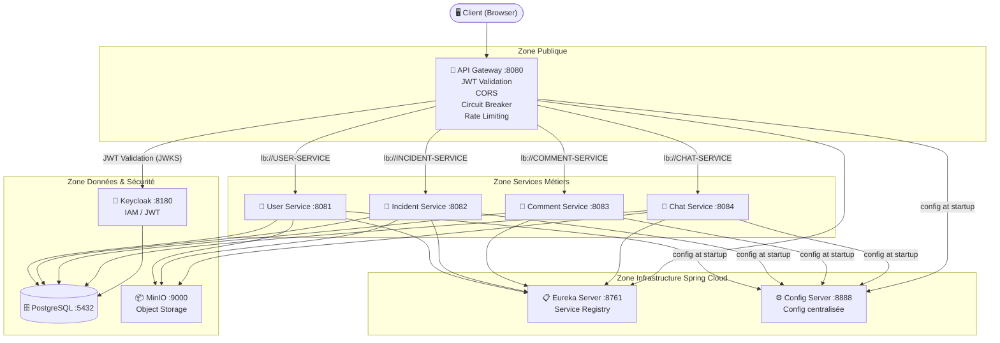

# 🚨 Incident Management Platform

Plateforme de gestion d'incidents informatiques basée sur une architecture **microservices** avec Spring Boot 3.x, Spring Cloud, Keycloak et Docker.

---

## 📋 Table des matières

- [Architecture](#architecture)
- [Structure du projet](#structure-du-projet)
- [Prérequis](#prérequis)
- [Démarrage rapide](#démarrage-rapide)
- [Services & URLs](#services--urls)
- [Configuration](#configuration)
- [Développement](#développement)
- [Sécurité](#sécurité)
- [Contribution](#contribution)

---

## 🏗️ Architecture

```
                         ┌─────────────────────────────────────┐
                         │         CLIENTS (Browser/App)        │
                         └──────────────┬──────────────────────┘
                                        │ HTTPS :8080
                         ┌──────────────▼──────────────────────┐
                         │         API GATEWAY (:8080)          │
                         │  • Routage (lb://SERVICE-NAME)       │
                         │  • Validation JWT Keycloak           │
                         │  • CORS                              │
                         │  • Circuit Breaker (Resilience4j)   │
                         │  • Rate Limiting                     │
                         └──┬───────┬───────┬──────┬───────────┘
                            │       │       │      │
          ┌─────────────────┼───────┼───────┼──────┼──────────────────┐
          │                 │       │       │      │                   │
   ┌──────▼──────┐  ┌───────▼─┐ ┌──▼────┐ ┌▼─────┴──┐               │
   │ USER-SERVICE│  │INCIDENT │ │COMMENT│ │  CHAT   │               │
   │  (:8081)    │  │ (:8082) │ │(:8083)│ │  (:8084)│               │
   └──────┬──────┘  └───────┬─┘ └──┬────┘ └┬────────┘               │
          │                 │       │        │                         │
          └─────────────────┴───────┴────────┘                        │
                            │                                          │
          ┌─────────────────┼──────────────────────────────────────┐  │
          │         INFRASTRUCTURE                                   │  │
          │                                                          │  │
          │  ┌──────────────────┐    ┌────────────────────────────┐ │  │
          │  │  EUREKA (:8761)  │    │  CONFIG SERVER (:8888)     │ │  │
          │  │  Service Register│    │  Config Git Backend        │ │  │
          │  └──────────────────┘    └────────────────────────────┘ │  │
          │                                                          │  │
          │  ┌──────────────┐  ┌──────────────┐  ┌───────────────┐ │  │
          │  │ POSTGRES(:5432)│ │ KEYCLOAK(:8180)│ │ MINIO (:9000) │ │  │
          │  └──────────────┘  └──────────────┘  └───────────────┘ │  │
          └─────────────────────────────────────────────────────────┘  │
```

### Flux d'authentification

```
Client → Gateway → Keycloak (token JWT)
Client → [Authorization: Bearer <token>] → Gateway
Gateway → Valide JWT (JWKS Keycloak) → Route vers microservice
Microservice → Reçoit la requête avec le token propagé
```

---

## 📁 Structure du projet

```
incident-management/              ← Racine du mono-repo
│
├── services/                     ← Code source des microservices
│   ├── eureka-server/            ← Service Register (port 8761)
│   │   ├── src/
│   │   ├── pom.xml
│   │   └── Dockerfile
│   │
│   ├── config-server/            ← Config Server (port 8888)
│   │   ├── src/
│   │   ├── pom.xml
│   │   └── Dockerfile
│   │
│   └── gateway/                  ← API Gateway (port 8080)
│       ├── src/
│       ├── pom.xml
│       └── Dockerfile
│
├── config-repo/                  ← Configurations centralisées (backend Git)
│   ├── application.yml           ← Config commune à tous les services
│   ├── user-service.yml          ← Config User Service
│   ├── incident-service.yml      ← Config Incident Service
│   ├── comment-service.yml       ← Config Comment Service
│   ├── chat-service.yml          ← Config Chat Service
│   └── gateway.yml               ← Config Gateway (overrides externes)
│
├── infrastructure/               ← Scripts d'infrastructure
│   ├── init-db.sql               ← Création des bases PostgreSQL
│   └── keycloak/
│       └── incident-realm.json   ← Realm Keycloak pré-configuré
│
├── docker-compose.yml            ← Orchestration complète
├── .env.example                  ← Template de variables d'environnement
├── .gitignore
└── README.md
```

---

## ✅ Prérequis

| Outil | Version minimale | Vérification |
|-------|-----------------|--------------|
| Java JDK | 17+ | `java -version` |
| Maven | 3.8+ | `mvn -version` |
| Docker | 24+ | `docker --version` |
| Docker Compose | 2.20+ | `docker compose version` |
| Git | 2.x | `git --version` |

**Ressources machine recommandées :**
- RAM : 8 Go minimum (16 Go recommandé)
- CPU : 4 cœurs
- Disque : 10 Go libres

---

## 🚀 Démarrage rapide

### 1. Cloner et préparer

```bash
git clone <url-du-repo> incident-management
cd incident-management

# Créer le fichier de variables d'environnement
cp .env.example .env
# Éditer .env si nécessaire (les valeurs par défaut fonctionnent en dev)
```

### 2. Initialiser le config-repo comme dépôt Git

> Le Config Server lit les fichiers depuis un dépôt Git.
> En développement, on utilise le répertoire local `config-repo/`.

```bash
cd config-repo
git init
git add .
git commit -m "Initial configuration"
git branch -M main
cd ..
```

### 3. Lancer l'infrastructure complète

```bash
# Build des images et démarrage de tous les services
docker-compose up --build

# Ou en arrière-plan
docker-compose up --build -d

# Suivre les logs
docker-compose logs -f
```

### 4. Vérifier que tout est démarré

```bash
# Attendre ~3 minutes que tous les services soient healthy
docker-compose ps

# Vérifier le registre Eureka
curl http://localhost:8761/actuator/health

# Vérifier le Config Server
curl -u configuser:configpassword http://localhost:8888/actuator/health

# Vérifier le Gateway
curl http://localhost:8080/actuator/health
```

---

## 🌐 Services & URLs

### Infrastructure (développement)

| Service | URL | Credentials |
|---------|-----|-------------|
| **Eureka Dashboard** | http://localhost:8761 | admin / admin |
| **Config Server** | http://localhost:8888 | configuser / configpassword |
| **API Gateway** | http://localhost:8080 | — (JWT requis) |
| **Keycloak Admin** | http://localhost:8180/admin | admin / admin |
| **Keycloak Realm** | http://localhost:8180/realms/incident-realm | — |
| **MinIO Console** | http://localhost:9001 | minioadmin / minioadmin123 |
| **PostgreSQL** | localhost:5432 | postgres / postgres |

### API via Gateway (nécessite un token JWT)

```bash
# Obtenir un token Keycloak
TOKEN=$(curl -s -X POST \
  "http://localhost:8180/realms/incident-realm/protocol/openid-connect/token" \
  -H "Content-Type: application/x-www-form-urlencoded" \
  -d "client_id=incident-frontend" \
  -d "username=admin" \
  -d "password=admin123" \
  -d "grant_type=password" \
  | jq -r '.access_token')

# Appel via Gateway
curl -H "Authorization: Bearer $TOKEN" http://localhost:8080/api/users
curl -H "Authorization: Bearer $TOKEN" http://localhost:8080/api/incidents
curl -H "Authorization: Bearer $TOKEN" http://localhost:8080/api/comments
curl -H "Authorization: Bearer $TOKEN" http://localhost:8080/api/chat
```

### Vérification de la configuration depuis le Config Server

```bash
# Config commune
curl -u configuser:configpassword http://localhost:8888/application/default

# Config du user-service
curl -u configuser:configpassword http://localhost:8888/user-service/default

# Config du gateway
curl -u configuser:configpassword http://localhost:8888/gateway/default
```

---

## ⚙️ Configuration

### Variables d'environnement clés

| Variable | Défaut | Description |
|----------|--------|-------------|
| `POSTGRES_PASSWORD` | postgres | Mot de passe PostgreSQL |
| `EUREKA_PASSWORD` | admin | Mot de passe Eureka |
| `CONFIG_SERVER_PASSWORD` | configpassword | Mot de passe Config Server |
| `KEYCLOAK_ADMIN_PASSWORD` | admin | Mot de passe admin Keycloak |
| `MINIO_SECRET_KEY` | minioadmin123 | Clé secrète MinIO |

### Modifier une configuration sans redémarrer

Le Config Server permet de modifier la configuration sans redémarrer les services (si Spring Cloud Bus est configuré) :

```bash
# Modifier un fichier dans config-repo/
vi config-repo/user-service.yml

# Committer le changement
cd config-repo && git add . && git commit -m "Update user-service config"

# Déclencher le refresh sur le service concerné (si actuator/refresh exposé)
curl -X POST http://localhost:8080/api/users/actuator/refresh
```

---

## 🔐 Sécurité

### Architecture de sécurité

```
┌─────────────┐    JWT Token    ┌─────────────┐
│   Frontend   │ ──────────────▶│   Gateway   │
│  React/Vue  │                │             │
└─────────────┘                │  Valide JWT │
                               │  via JWKS   │
                               └──────┬──────┘
                                      │
                               ┌──────▼──────┐
                               │  Keycloak   │
                               │ JWKS Endpoint│
                               └─────────────┘
```

### Realm Keycloak pré-configuré

Le fichier `infrastructure/keycloak/incident-realm.json` configure automatiquement :
- **Realm** : `incident-realm`
- **Clients** : `incident-frontend` (public), `incident-backend` (confidentiel)
- **Rôles** : `ROLE_USER`, `ROLE_TECHNICIAN`, `ROLE_MANAGER`, `ROLE_ADMIN`
- **Utilisateurs de test** : `admin` / `admin123`, `technicien1` / `tech123`

### Valider un token JWT

```bash
# Décoder un token (sans vérifier la signature, pour debug)
echo $TOKEN | cut -d'.' -f2 | base64 -d 2>/dev/null | jq .
```

---

## 🛠️ Développement

### Lancer un seul service en local

```bash
# Lancer l'infrastructure (postgres, keycloak, eureka, config)
docker-compose up postgres keycloak eureka-server config-server -d

# Lancer le gateway en local (hors Docker)
cd services/gateway
mvn spring-boot:run
```

### Rebuild un seul service

```bash
# Rebuilder et redémarrer uniquement le gateway
docker-compose up --build -d gateway
```

### Arrêter l'environnement

```bash
# Arrêt sans supprimer les données
docker-compose down

# Arrêt + suppression des volumes (reset complet)
docker-compose down -v
```

### Visualiser les routes du Gateway

```bash
curl http://localhost:8080/actuator/gateway/routes | jq .
```

### Vérifier l'état des circuit breakers

```bash
curl http://localhost:8080/actuator/circuitbreakers | jq .
```

---

## 📊 Diagramme Mermaid - Architecture globale



---

## 👥 Répartition des membres

| Membre | Responsabilités |
|--------|----------------|
| **Membre 1 (Infrastructure)** | Eureka, Config Server, Gateway, Docker, CI/CD |
| **Membre 2 (Sécurité & Users)** | Keycloak, User Service |
| **Membre 3 (Incidents)** | Incident Service, Comment Service |
| **Membre 4 (Temps réel)** | Chat Service, WebSocket |

---

## 📝 Notes techniques

### Pourquoi Spring Cloud Gateway et pas Zuul ?
Zuul (Netflix) est basé sur le modèle de threads bloquants. Spring Cloud Gateway utilise **WebFlux (Project Reactor)**, non-bloquant, bien plus performant pour les cas d'usage de gateway (proxy, filtres, routing).

### Pourquoi un Config Server et pas des ConfigMaps Kubernetes ?
En phase de développement avec Docker Compose, le Config Server est plus simple à gérer. La même approche peut être migrée vers Kubernetes en remplaçant le backend Git par des ConfigMaps, avec un changement minimal dans les clients.

### Pourquoi `lb://` dans les routes du Gateway ?
Le préfixe `lb://` (Load Balanced) indique à Spring Cloud Gateway d'utiliser le client Eureka + Ribbon/Spring Cloud LoadBalancer pour résoudre l'URL du service. Cela permet le **load balancing** automatique si plusieurs instances du même service sont lancées.
